## Genética Quantitativa

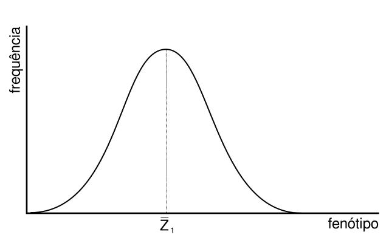

---

## Genética Quantitativa

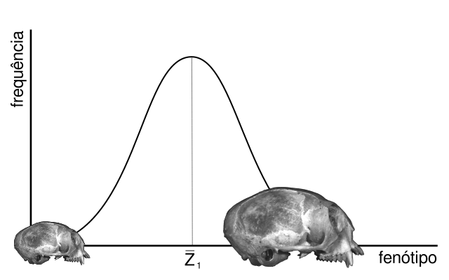


---

## Genética Quantitativa

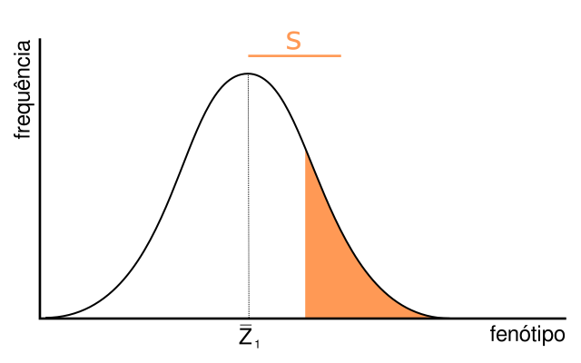

\[ \Delta \bar{z} = \frac {\sigma^2_a}{\sigma^2_p} s \]

--- 

## Genética Quantitativa

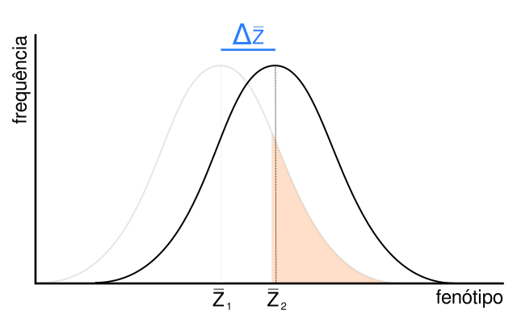

\[ \Delta \bar{z} = \frac {\sigma^2_a}{\sigma^2_p} s \]

---

## Fenótipos Multidimensionais

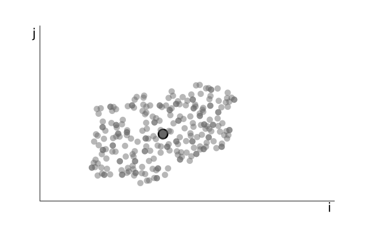

---

## Fenótipos Multidimensionais

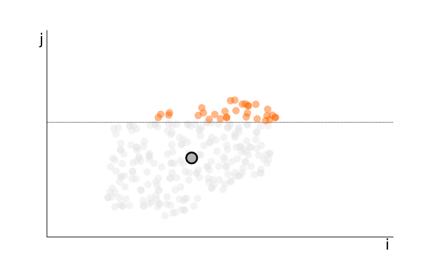

---

## Fenótipos Multidimensionais

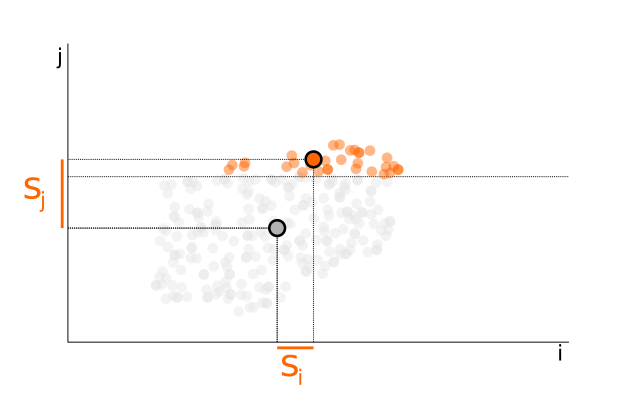

---

## Equação de Lande (1979)

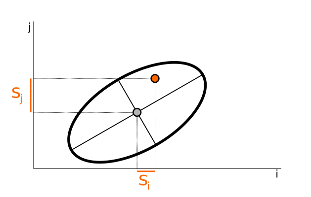

\[ \Delta \bar{\mathbf{z}} = \mathbf{G} \mathbf{P}^{-1} \mathbf{s} \]

---

## Equação de Lande (1979)

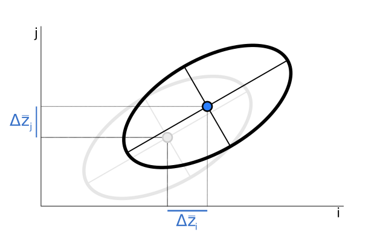

\[ \Delta \bar{\mathbf{z}} = \mathbf{G} \mathbf{P}^{-1} \mathbf{s} \]

---

## Paisagem Adaptativa

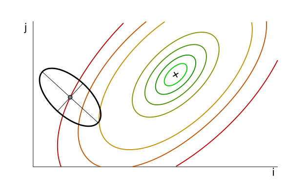

---

## Paisagem Adaptativa

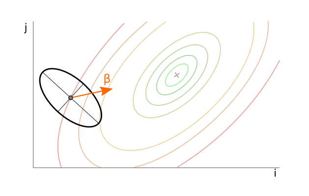

\[ \beta = \nabla\ \text{ln}\ \bar{W}(\mathbf{z}) \]

---

## Paisagem Adaptativa


\[ \beta = \mathbf{P}^{-1} \mathbf{s} \]

---

## Paisagem Adaptativa

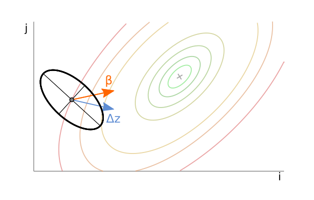

\[ \Delta \bar{\mathbf{z}} = \mathbf{G} \beta \]

---

## Paisagem Adaptativa

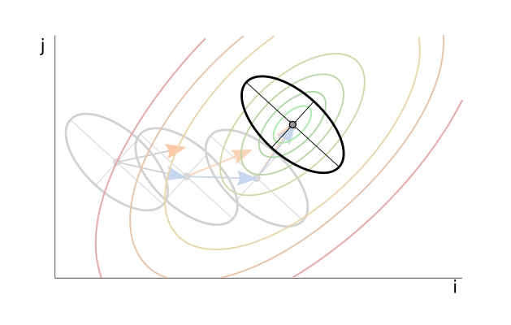

\[ \Delta \bar{\mathbf{z}} = \mathbf{G} \beta \]

---

## Evolução em Conjunto

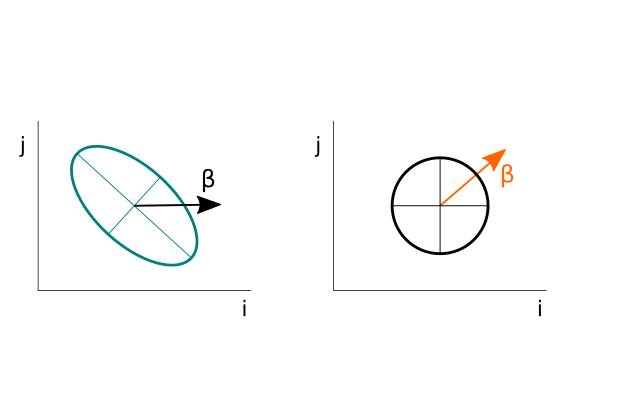

*** =pnotes

Caracteres fenotípicos evoluem de maneira concertada devido a covariâncias genéticas ou por serem selecionados conjuntamente.

--- {.build}

## Integração Morfológica

* **Olson \& Miller (1958)**

* Organização das correlações fenotípicas entre elementos morfológicos.

* Hipóteses a respeito dos padrões observados:

  + Participação conjunta em complexos funcionais;
  + Vias de desenvolvimento compartilhadas;
  + Fatores genéticos: pleiotropia e desequilíbrio de ligação;
  + Co-seleção.

---

## Mapa Genótipo-Fenótipo

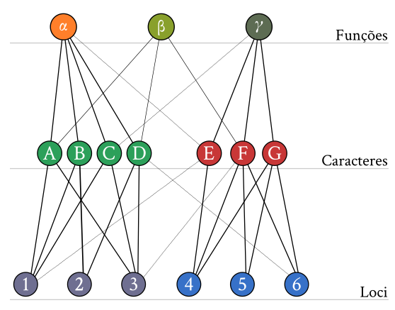

<span class='footnote'> (Wagner, 1996) </span>

--- &twocol

## Crânio de Mamíferos

*** =left

* Desenvolvimento: 

  - <font color='#0064FF'> Mesoderme Paraxial </font>

  - <font color='#FF181A'> Crista Neural </font>

*** =right

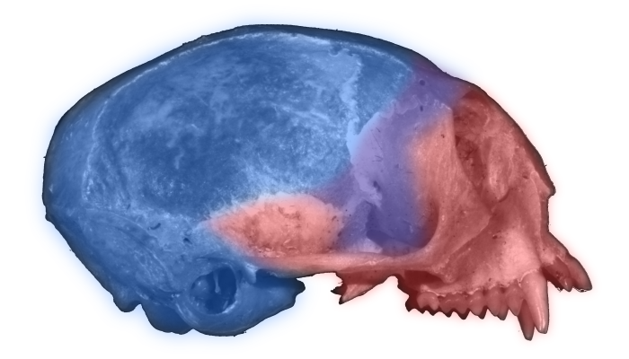

--- &twocol

## Crânio de Mamíferos

*** =left

* Desenvolvimento: 

  - Face: <font color='#0064FF'> Mesoderme Paraxial </font>

  - Neurocrânio: <font color='#FF181A'> Crista Neural </font>

* Função:

  - <font color='#f423f7'> Oral </font>
  
  - <font color='#ed536a'> Nasal </font>

  - <font color='#00f00e'> Zigomático </font>
  
  - <font color='#c8ab37'> Órbita </font>

  - <font color='#124bee'> Base </font>
  
  - <font color='#00c4bd'> Abóbada </font>

*** =right


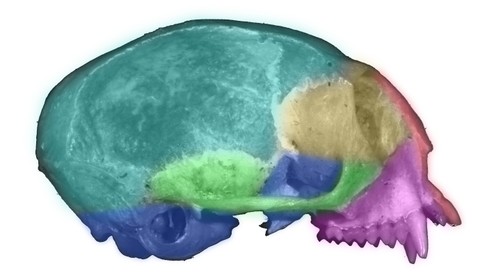

---

## Expectativas

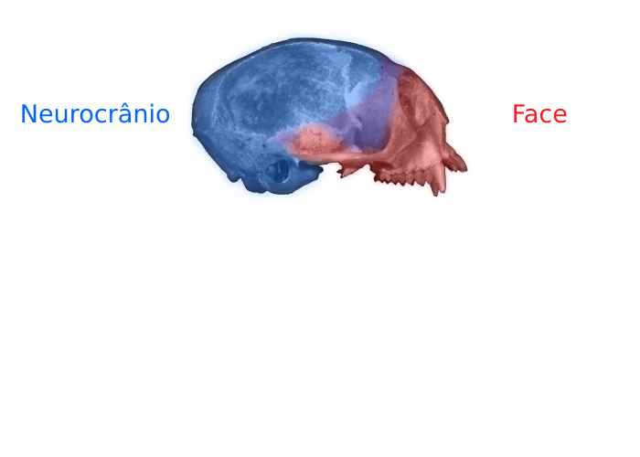

---

## Expectativas

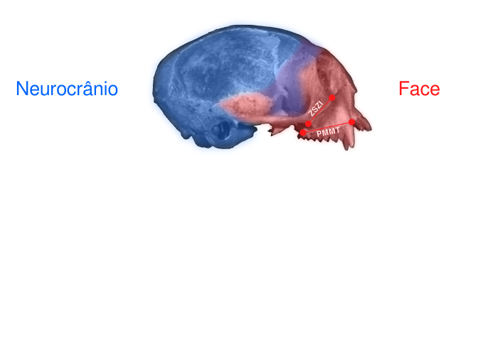

---

## Expectativas

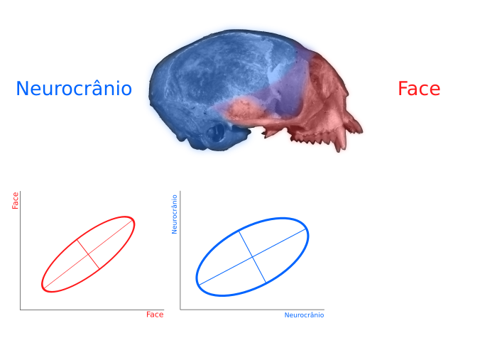

---

## Expectativas

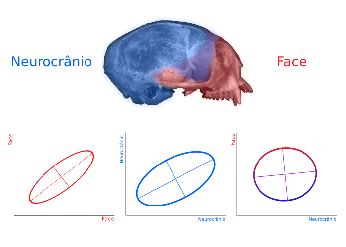

---

## Mas...

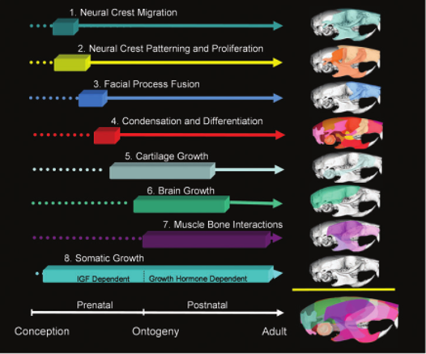

---

## Mudanças na Matriz **G** 

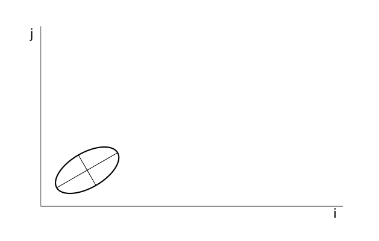

\[ \Delta \mathbf{G} = \mathbf{G} \big( \mathbf{\gamma} - \beta\beta^T \big) \mathbf{G} + \mathbf{U}\]

<span class="footnote"> (Arnold, 1992) </span>

---

## Seleção Direcional

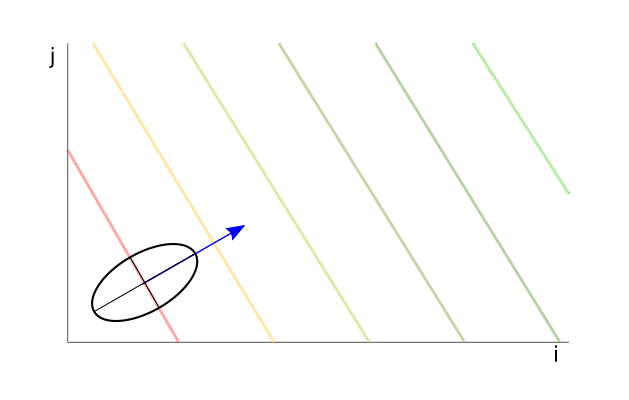

\[ \Delta \mathbf{G} = \mathbf{G} \big( \mathbf{\gamma} - {\color{blue} \beta\beta^T} \big)\mathbf{G} + \mathbf{U} \]

---

## Seleção Direcional

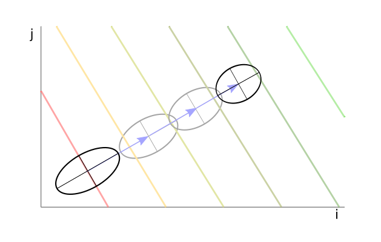

\[ \Delta \mathbf{G} = \mathbf{G} \big( \mathbf{\gamma} - {\color{blue} \beta\beta^T} \big)\mathbf{G} + \mathbf{U} \]

---

## Seleção Estabilizadora

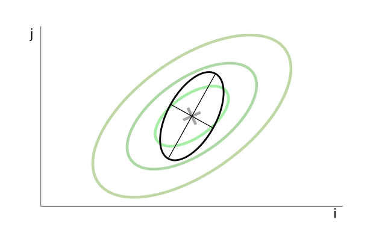

\[ \Delta \mathbf{G} = \mathbf{G} \big( \mathbf{\gamma} - \beta\beta^T \big)\mathbf{G} + \mathbf{U}\]

---

## Seleção Estabilizadora


\[ \Delta \mathbf{G} = \mathbf{G}\mathbf{\gamma}\mathbf{G} + \mathbf{U}\]

---

## Seleção Estabilizadora

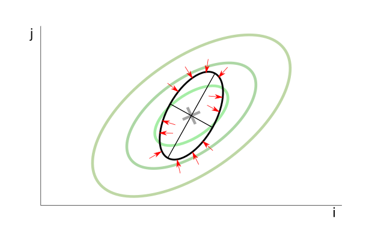

\[ \Delta \mathbf{G} = \mathbf{G} {\color{red}\mathbf{\gamma}}\mathbf{G} + \mathbf{U} \]

---

## Mutação e Recombinação

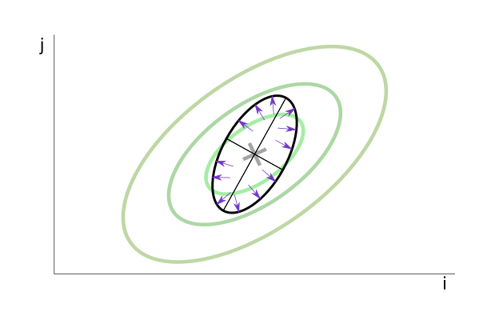

\[ \Delta \mathbf{G} = \mathbf{G} \mathbf{\gamma}\mathbf{G} + {\color{purple}\mathbf{U}} \]

---

## Equilíbrio

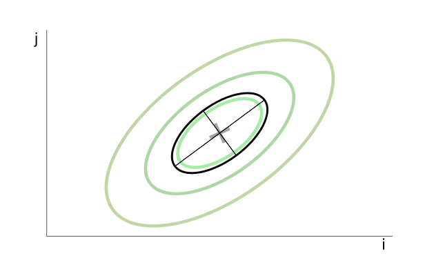

\[ \Delta \mathbf{G} = 0 \]

---

## Equilíbrio

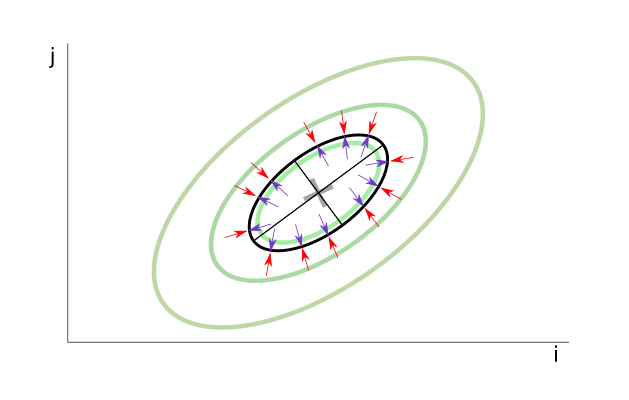

\[ {\color{purple}\mathbf{U}} = - \mathbf{G} {\color{red}\mathbf{\gamma}} \mathbf{G} \]

---

## Pleiotropia Epistática

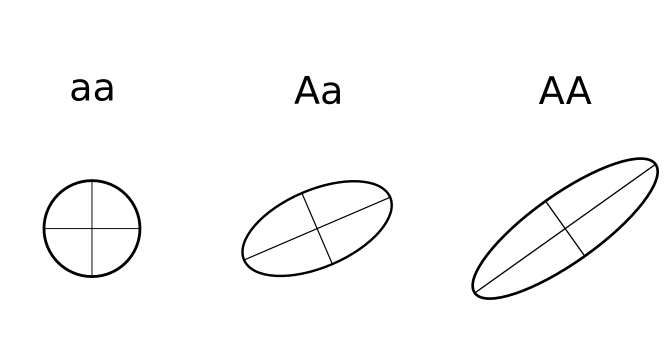

\[
\mathbf{R}_{aa} =
\begin{bmatrix}
1 & 0 \\
0 & 1 \\
\end{bmatrix}
\qquad
\mathbf{R}_{Aa} =
\begin{bmatrix}
1 & 0.5 \\
0.5 & 1 \\
\end{bmatrix}
\qquad
\mathbf{R}_{AA} =
\begin{bmatrix}
1 & 0.7 \\
0.7 & 1 \\
\end{bmatrix}
\]

<span class='footnote'> (Wagner et al, 2007) </span>

---

## Pleiotropia Epistática

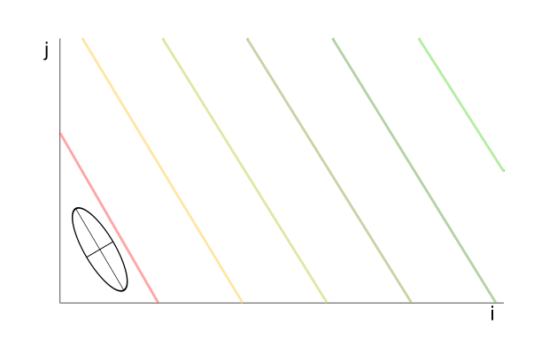

---

## Pleiotropia Epistática

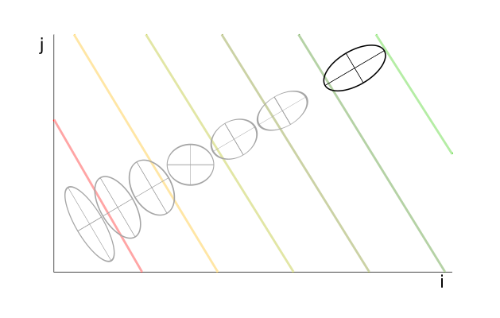

*** =pnotes

Seleção direcional pode alterar padrões de covariância entre caracteres fenotípicos.

---

## Pleiotropia Epistática

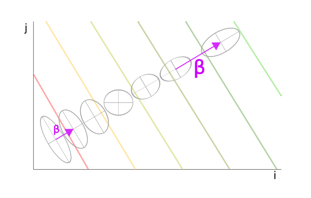

---

## Morfometria

---

## Análise Generalizada de Procrustes

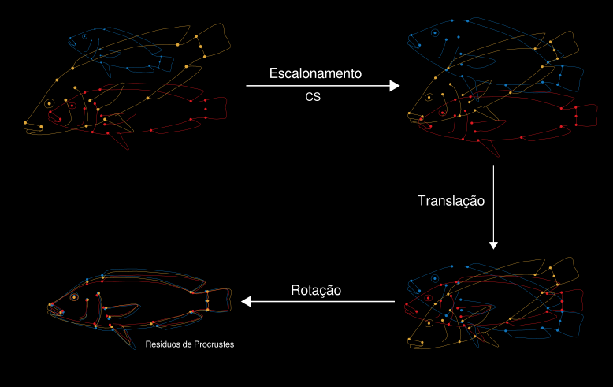

---

## Cercopithecoidea

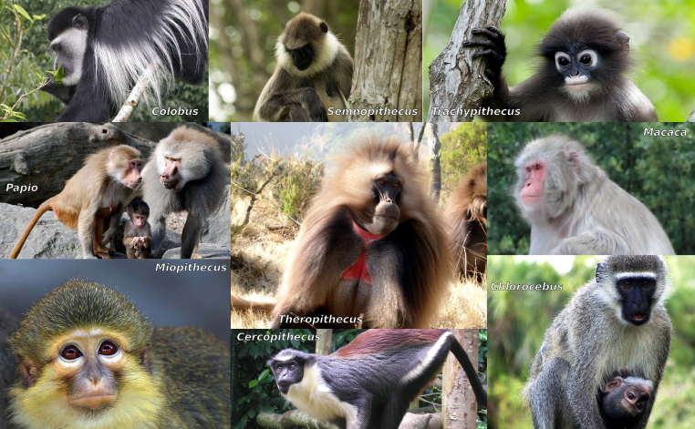

---

## Hominoidea

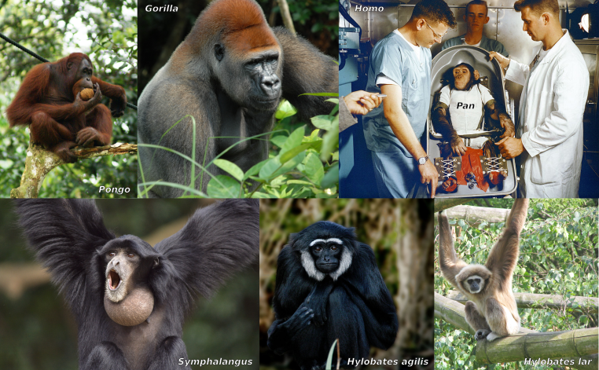

---

## Pitheciidae/Atelidae

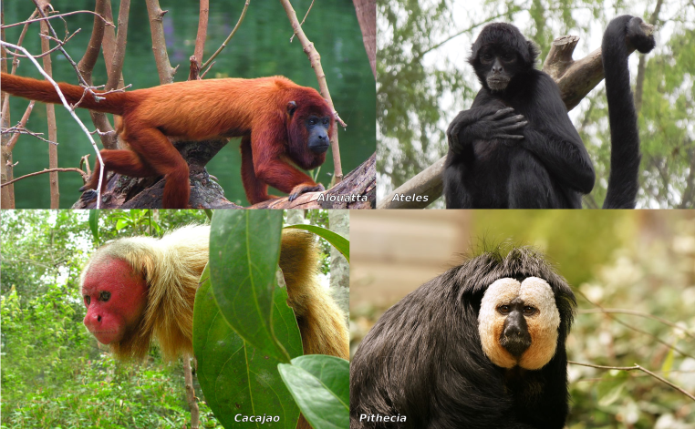

---

## Cebidae

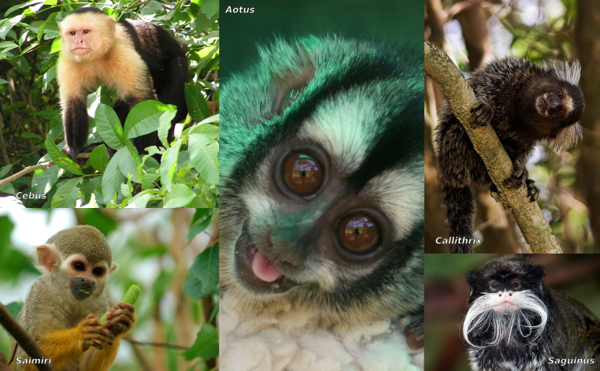

---

## Relações Filogenéticas em Anthropoidea

```{r base_tree, echo = FALSE, fig.width = 11, fig.height = 7}
base.tree
```

<span class='footnote'> (Springer et al, 2012) </span>

---

## Seleção em Platyrrhini

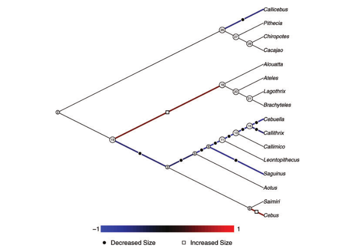

<span class='footnote'> (Marroig et al, 2012) </span>

---

## Seleção em Homininae

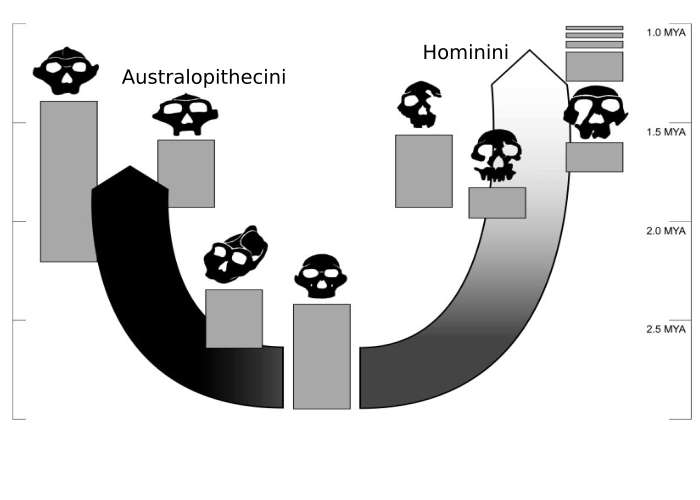

<span class='footnote'> (Ackermann \& Cheverud, 2004) </span>
