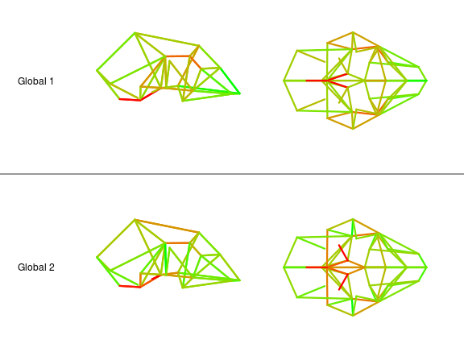
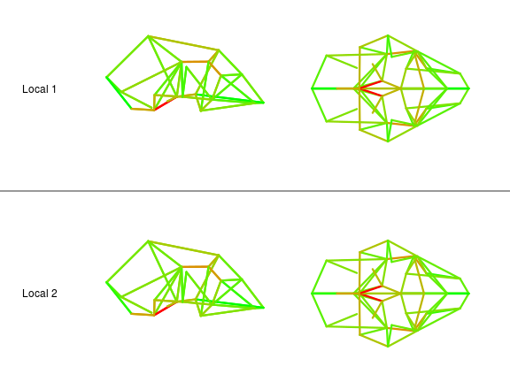

# A Phylogenetic Analysis of Covariance Structure in the Skull of Anthropoid Primates

## Guilherme Garcia & Gabriel Marroig

### University of São Paulo - Brasil

---

## Mammalian Skull Development


<aside class='notes'>
  Morphological systems have a tendency to exhibit covariation among its components due to developmental interactions. In the mammalian skull, for instance, adult phenotypes are assembled by a series of developmental processes; the timing, rate and scope of such processes structures covariance patterns.
</aside>

--- &vertical

## Landmarks and Measurements 


*** 


---

## 

 

---

## 


--- &vertical

### Phylogenetic Distribution of Matrix Disparity

 

***

### Tests for Phylogenetic Distribution of Disparity 


```
##                                        Value Expectation  Distance P-value
## Single Node                        0.1058344  0.02863164  13.45587   1e-04
## Few Nodes                          0.2482746   0.1394544  13.54525   1e-04
## Tip/Root Skewness (Topology Only)  0.6317855   0.5047114  12.19689   1e-04
## Tip/Root Skewness (Branch Lengths) 0.3812437   0.5046797 -11.06684   1e-04
```

--- &twocol

### pPCA Eigenvalue Distribution

*** =left

 

*** =right

 

---

## 

 

---

## 

 

---

## 

 

---

##

 

---

## 

 

---

## 

 

---

## 

 

---

## 

 

---

## 

 

---

## Local Shape Changes

 

--- 

## References


