### A Phylogenetic Analysis of Covariance Structure in the Skull of Anthropoid Primates

Guilherme Garcia & Gabriel Marroig

University of São Paulo - Brasil

--- &vertical

## Skull Development

Hallgrímsson *et al.* (2008)

*** =pnotes

Morphological systems have a tendency to exhibit covariation among its components due to developmental interactions. In the mammalian skull, for instance, adult phenotypes are assembled by a series of developmental processes; variation in timing, rate and scope of such processes structures covariance patterns. Covariance structure in adult phenotypes is also influenced by the effects of canalization and stabilizing selection, both over developmental systems themselves and functional interactions in the resulting phenotypes. These factors may limit variation in developmental processes, thus limiting changes in covariance structure.

***

- Canalization;

- Stabilizing Selection.
  + developmental systems;
  + functional interactions.

---

We expect that changes in covariance structure between sister lineages will display a non-random pattern consistent with developmental and functional interactions.

---

## Objective

We investigate the evolution of skull size-shape covariance structure in anthropoid primates in a phylogenetic framework.

---

## Sample

- 5108 individuals;

- 109 species.

*** =pnotes

Species distributed throught all major taxonomic groupings of Anthropoidea above the genus level.

--- 

## Measurements

- log Centroid Size;

- Local shape variables (Márquez *et al.*, 2012):
  + log volume transformations;
  + TPS function.

--- &vertical

## Landmarks 

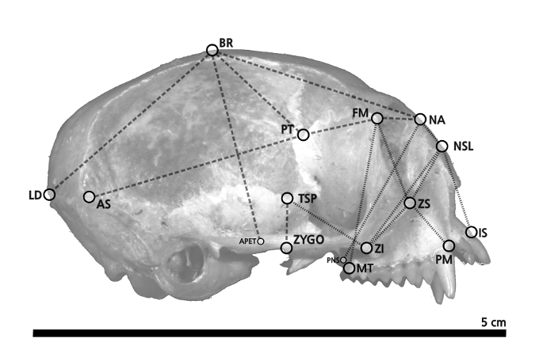

*** =pnotes

We estimate local shape variables along the midlines of each of the distances depicted here, in lateral and ventral views over a marmoset skull.

***

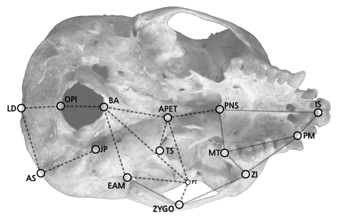

---

## Skull Regions 

*** =pnotes

These traits are grouped according to their developmental origins and functional interactions; these regions are used here as a framework to interpret changes in covariance structure, linking such changes to developmental processes.

--- &vertical

### Estimating Covariance Matrices

- Linear models to correct for fixed effects:
  + sexual dimorphism, subspecific variation.

- Bayesian framework (MCMCglmm; Hadfield, 2010):
  + posterior distribution of P-matrices.

***

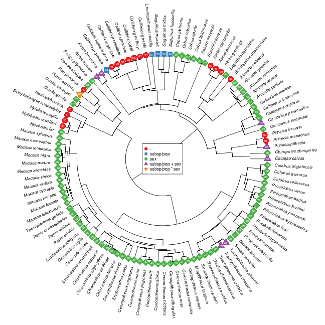 

--- &vertical

### Diversity Decomposition

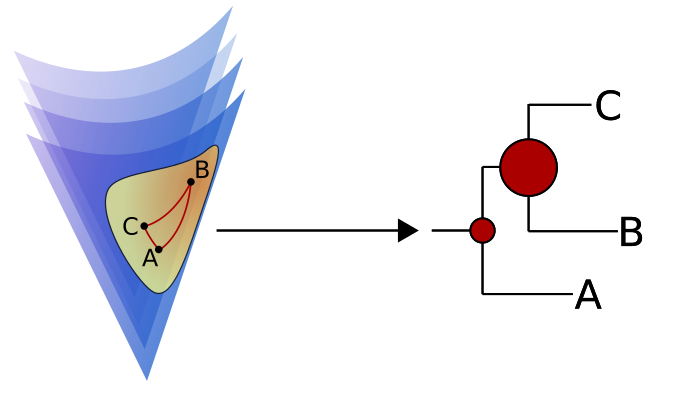

Pavoine *et al.* (2008)

*** =pnotes

We estimate Riemannian distances between these matrices, and we subject these distances to a decomposition of matrix disparity along the phylogeny. Using a randomization procedure, we evaluated a series of hypotheses concerning the distribution of matrix disparity throughout anthropoid diversification; for instance, if this diversity is concentrated in  a single tip, in few tips, or whether diversity is skewed towards either root or tips of the phylogeny.

***

For a fully resolved tree, diversity $w$ on node $i$ is estimated as

&nbsp;
&nbsp;

$$
w_i = \frac{n_i}{n_T}\bigg[\frac{n_{d1}n_{d2}}
{n_i^2} \frac{D_{\Delta}^2(P_{d1}, P_{d2})}{2}\bigg]
$$
&nbsp;

- $d1$, $d2$: descendants of node $i$;

- $n_i$: number of tips descending from node $i$;

***

$$
D_{\Delta} (P_i, P_j) =
\Bigg[2 \bigg( 2 H_{\Delta} \bigg( \frac{P_i + P_j}{2} \bigg) -
H_{\Delta}(P_i) - H_{\Delta}(P_j) \bigg)\Bigg]^{\frac{1}{2}}
$$

&nbsp;

$$
H_{\Delta} (P) = \sum_{i,j \in P} \frac{\delta_{ij}^2}{2}
$$

***

$$ \delta_{ij} = \|Log(C_i C_j^{-1})\|_F $$

---

### Eigentensors 

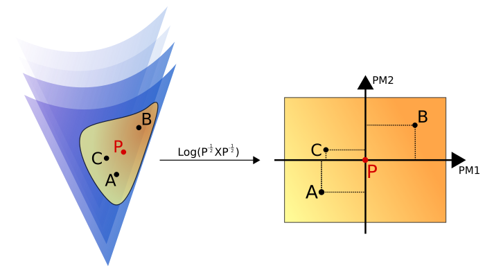

Hine *et al.* (2006)

*** =pnotes

Furthermore, in order to properly describe covariance matrix variation, we use eigentensor decomposition, that is, a principal component analysis of covariance matrices after mapping them to an Euclidean space.

--- &vertical

### Phylogenetic Principal Components

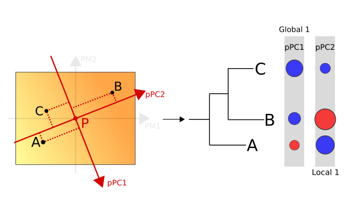

Jombart *et al.* (2010)

*** =pnotes

We then use covariance matrix projections over eigentensors as traits in a phylogenetic Principal Component Analysis (pPCA), which decomposes projections into axes that are associated with global (close to root) and local (close to tips) matrix disparity.

***

Spectral decomposition of the matrix

&nbsp;
&nbsp;

$$
\frac{1}{2n}\mathbf{X}^t(\mathbf{W} + \mathbf{W}^t)\mathbf{X}
$$

&nbsp;

- $n$: number of tips;

- $\mathbf{X}$: data for tips (here, principal matrix projections);

- $\mathbf{W}$: phylogenetic distance matrix.

---

### Reconstructing Matrix Variation

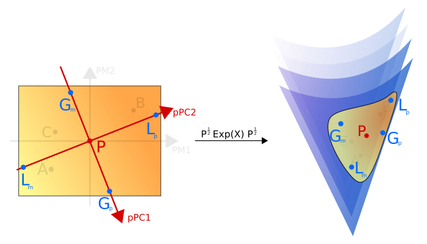

*** =pnotes

For each pPCA axis, we reconstruct two covariance matrices, associated with the lower and upper bounds of their 95% confidence intervals.

---

### Matrix Variation along pPC Axes

- Selection Response Decomposition (SRD; Marroig *et al.*, 2011);

- posterior distribution of differences in trait-specific covariance structure.

*** =pnotes

We subject each pair of matrices to Selection Response Decomposition, in order to evaluate which traits are associated with divergence in covariance structure for each hierarchical level in the phylogeny, defined by the phylogenetic PCs. And, by repeating pPCA using each set of posterior samples for our covariance matrices, we are able to estimate a posterior distribution of mean SRD scores for each trait.

--- &vertical

### Covariance Matrix Diversity

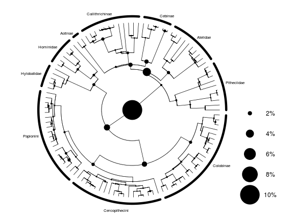 

*** =pnotes

The tests of matrix disparity along the phylogeny indicate that most divergence in covariance structure is skewed towards the root of the tree, therefore associated with the split between New and Old World Monkeys.

***

### Tests for Distribution of Matrix Diversity

|                                   | Value|  Exp.|   Dist.|P       |
|:----------------------------------|-----:|-----:|-------:|:-------|
|Single Node                        | 0.106| 0.029|  13.456|< 10^-4 |
|Few Nodes                          | 0.248| 0.139|  13.545|< 10^-4 |
|Tip/Root Skewness (Topology Only)  | 0.632| 0.505|  12.197|< 10^-4 |
|Tip/Root Skewness (Branch Lengths) | 0.381| 0.505| -11.067|< 10^-4 |

--- &vertical

### pPCA Eigenvalue Distribution

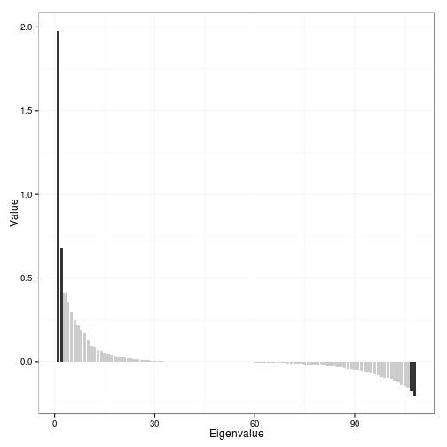 

***

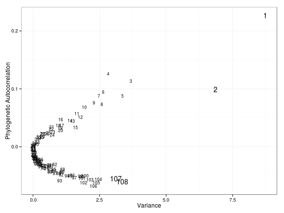 

--- &vertical

## Global pPC1

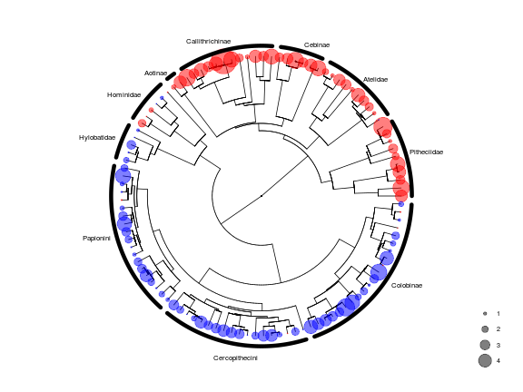 

*** =pnotes

The first global pPC captures this split (with Hominids in between), and

***

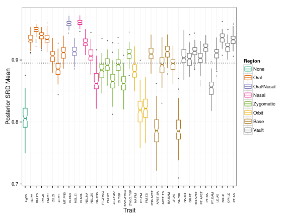 

*** =pnotes

the SRD analysis over covariance matrices recovered from the first global pPC indicate that this split is mostly associated with changes in the covariance structure of Centroid Size, Basicranial, and Orbital traits, while traits in remaining regions are quite stable in terms of covariance structure.

--- &vertical

## Global pPC2

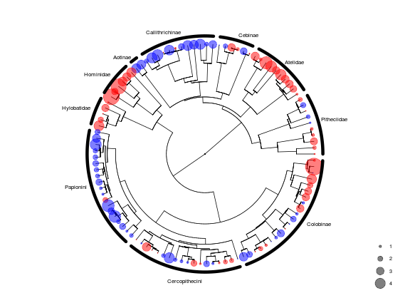 

*** =pnotes

The second global pPC depicts contrasts within Platyrrhini and Catarrhini, associated with the split between Atelidae and Cebidae and between Hominoidea and Cercopithecoidea. The pattern of trait covariance structure, however, indicate the same traits associated with both global structures.

***

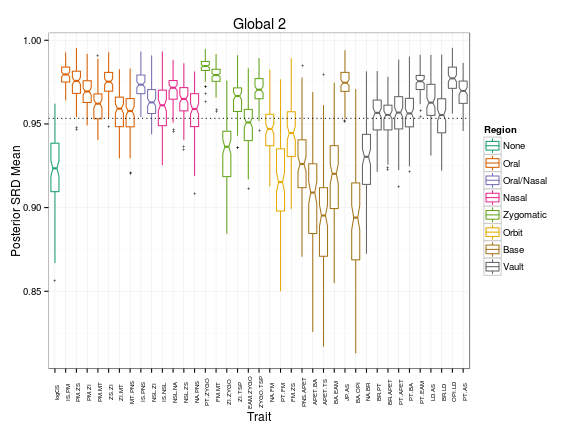 

--- &vertical

## Local pPC1

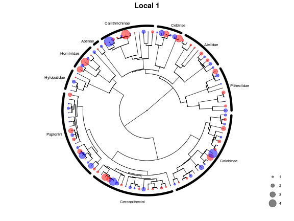 

***

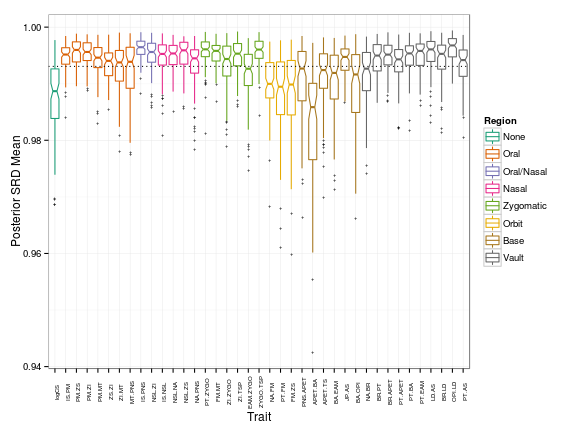 

--- &vertical

## Local pPC2

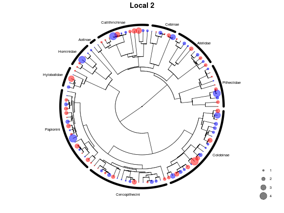 

*** 

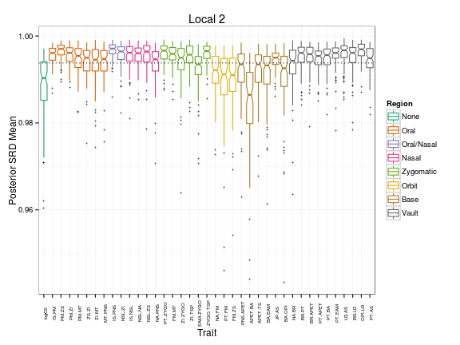 

--- 

