## Perspectivas sobre o reconhecimento de padrões de modularidade e suas implicações para a evolução de morfologias complexas

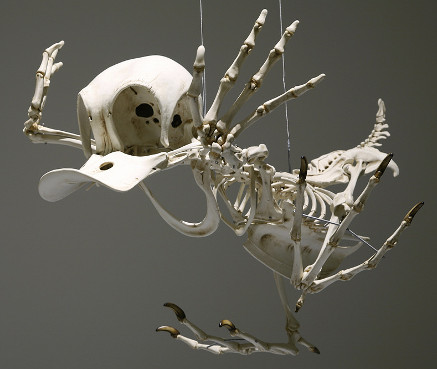
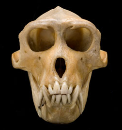

&nbsp;
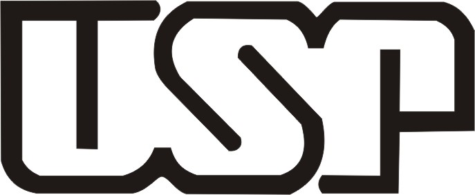
 

---

## Modularidade

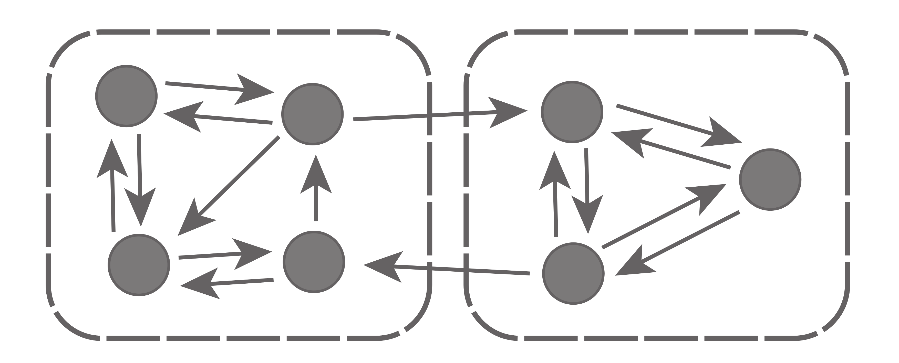

*** =pnotes

propriedade característica associada à distribuição das interações entre elementos de um sistema biológico

certos elementos interagem entre si mais do que com outros subconjuntos

---

## Sistemas Morfológicos

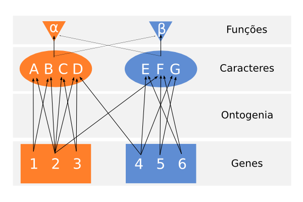

*** =pnotes

em sistemas morfológicos, as interações entre elementos são advindas dos efeitos conjuntos entre redes de regulação gênica, as vias de desenvolvimento compartilhadas entre elementos e interações funcionais

---

## Campos Morfogenéticos

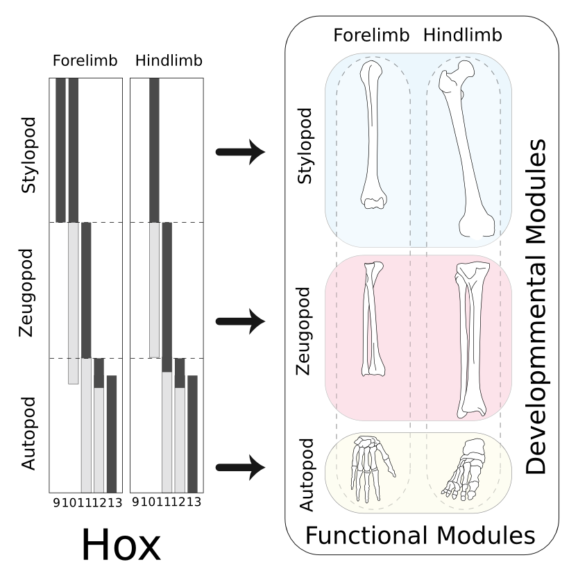

---

## Interações Ontogenéticas

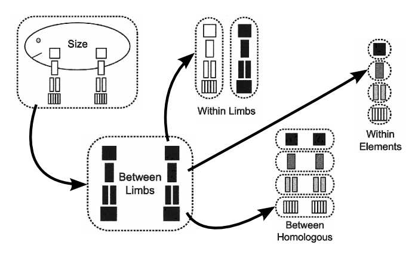

---

---

## Interações Funcionais

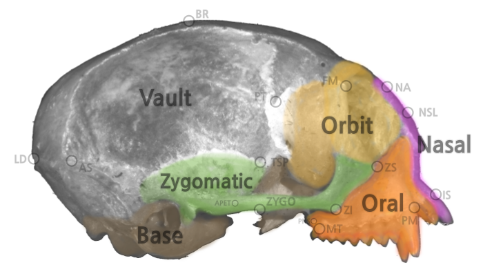

--- &vertical

## Matrizes de Covariância

$$
\begin{bmatrix}
	\sigma_{1}^2 & cov_{1,2} & cov_{1,3} & \cdots \\
	cov_{2,1} & \sigma_{2}^2 & cov_{2,3} & \cdots \\
	cov_{3,1} & cov_{1,2} & \sigma_{3}^2 & \cdots \\
	\vdots & \vdots & \vdots & \ddots \\
\end{bmatrix}
$$

***

## Matrizes de Correlação

$$
\begin{bmatrix}
	1 & \rho_{1,2} & \rho_{1,3} & \cdots \\
	\rho_{2,1} & 1 & \rho_{2,3} & \cdots \\
	\rho_{3,1} & \rho_{1,2} & 1 & \cdots \\
	\vdots & \vdots & \vdots & \ddots \\
\end{bmatrix}
$$

---

## Resposta a Seleção

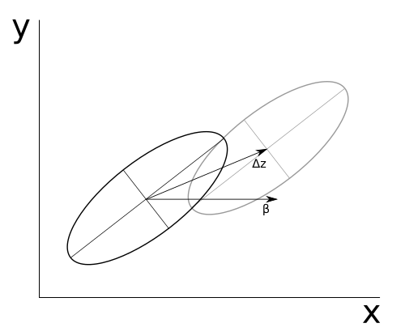

&nbsp;
$$
\Delta \bar{z} = \mathbf{G} \beta
$$

---

## Como representar elementos morfológicos?

---

## Distâncias Euclidianas

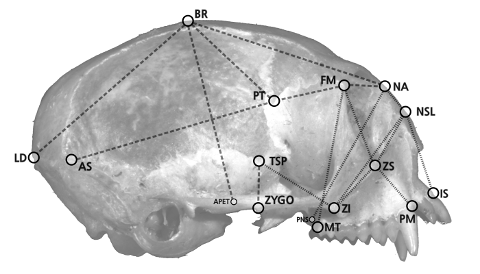

--- 

## Landmarks

--- &vertical

### Algoritmos de Procrustes

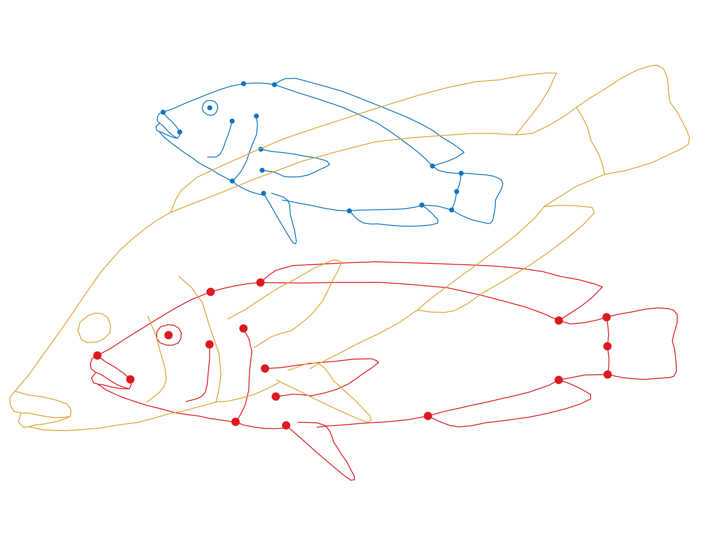

***

#### Escalonamento

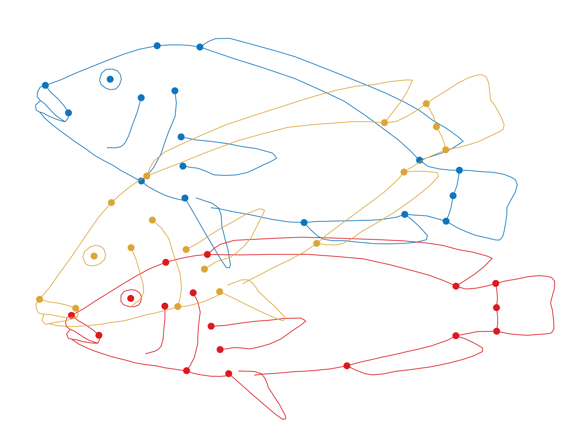

***

#### Translação

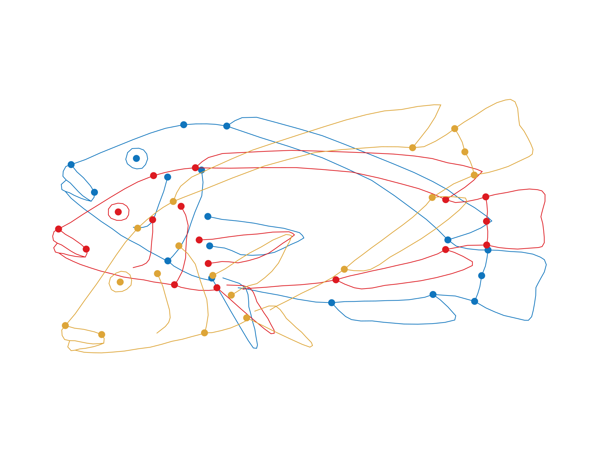

***

#### Rotação

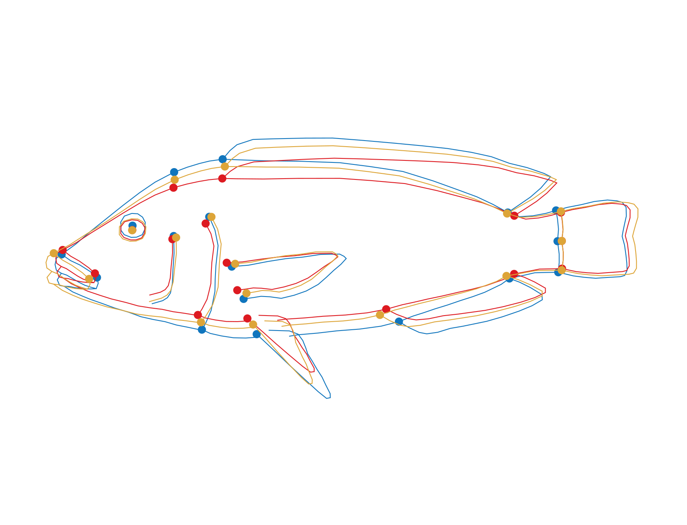

--- &vertical

## Problemas

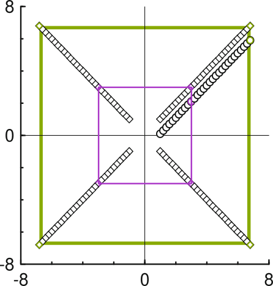

***

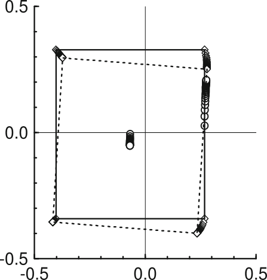

***

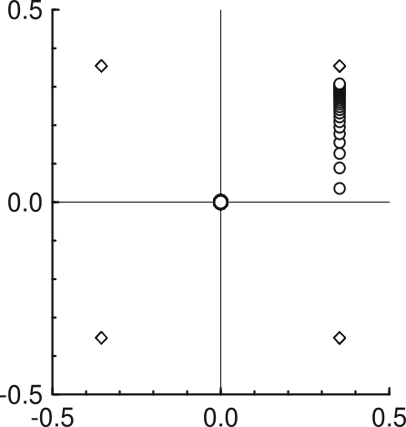

--- &twocol

## Deformações

*** =left

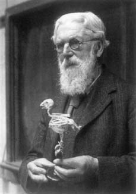

*** =right

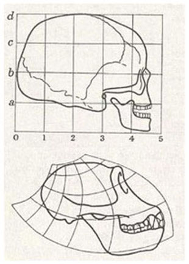

--- &twocol

## Deformações

*** =left

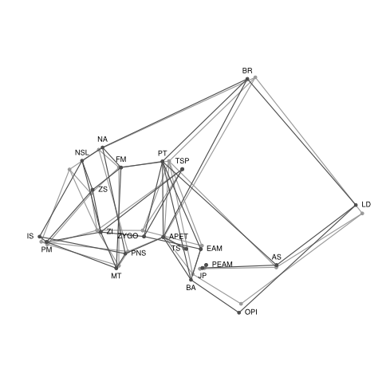

*** =right

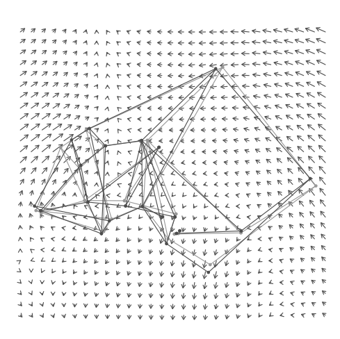

*** =pnotes

D'arcy Thompson, 1917. *On growth and form.*

--- &twocol

## Variáveis Locais de Forma

*** =left

*** =right

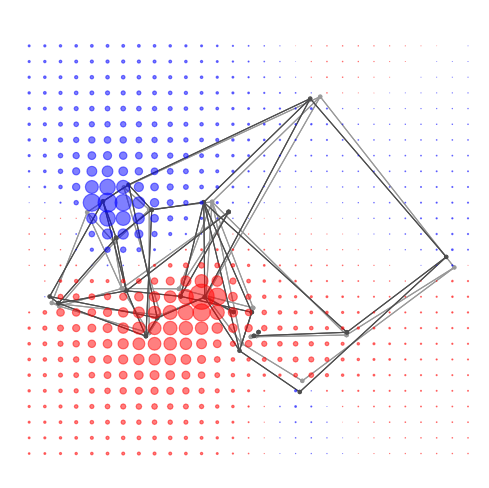

---

## Objetivo

Investigar a relação entre as representações utilizadas para caracterizar variação morfológica e as inferências feitas a partir destas representações a respeito de propriedades variacionais em escala macroevolutiva.

--- &vertical

## Anthropoidea

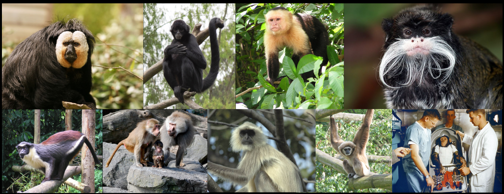

***

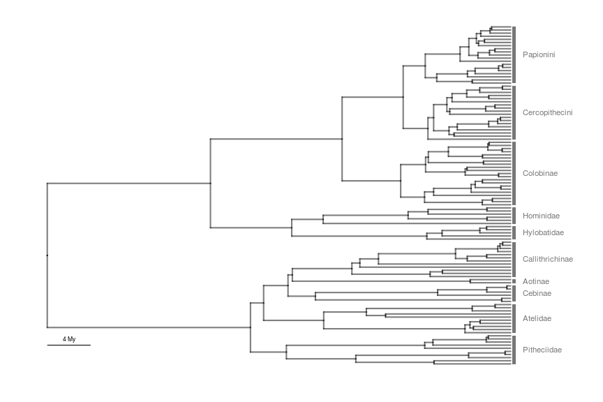

---

## Perfil da Tese

1. Taxas de erro em testes de hipótese *a priori*

2. Alometria e modularidade

3. Análise comparativa de matrizes de covariância

---

## Alometria

---

## Perguntas

- Os parâmetros de alometria estática no crânio mudaram ao longo da diversificação dos Anthropoidea?

- Existe relação entre estes parâmetros (em especial, $b_s$) e a magnitude de associação entre caracteres nas diferentes regiões do crânio?

---

## Métodos

---

## Modularidade

  - matrizes de correlação entre distâncias *interlandmark*

  + *Índice de Modularidade*:

&nbsp;
$$ MHI = \frac{\bar{\rho}_+ - \bar{\rho}_-}{ICV} $$

---

## Alometria

- Regressão de projeções no Componente Alométrico Comum sobre o logCS

  + projeções estimadas a partir de variáveis locais de forma

&nbsp;
- *Regressão aleatória*:

  + parâmetros da regressão dentro de cada espécie ($a_s$; $b_s$) seguem uma distribuição multivariada normal dependente da filogenia.

---

*Os parâmetros de alometria estática no crânio mudaram ao longo da diversificação dos Anthropoidea?*

&nbsp;
- estimativas de intervalos de credibilidade para os parâmetros da alometria estática ($a_s$ e $b_s$) ao longo da filogenia

---

*Existe relação entre estes parâmetros (em especial, $b_s$) e a magnitude de associação entre caracteres nas diferentes regiões do crânio?*

&nbsp;
- regressão filogenética dos Índices de Modularidade sobre parâmetros alométricos
&nbsp;
- seleção de modelos

---

## Resultados

---

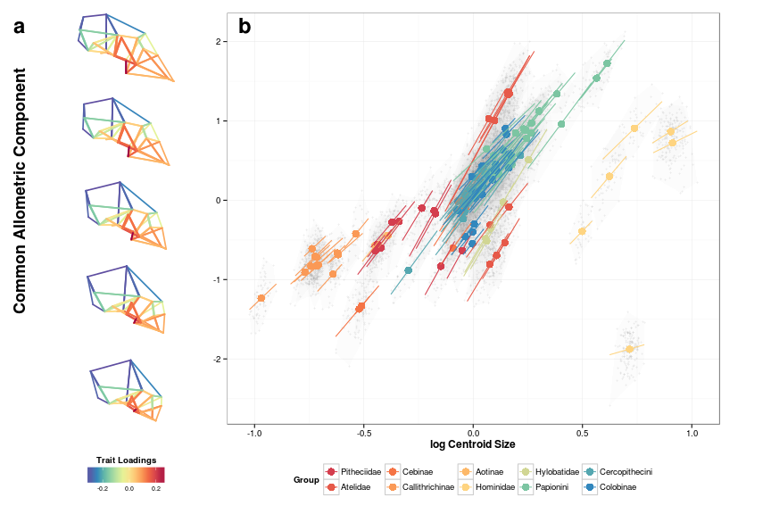

--- &vertical

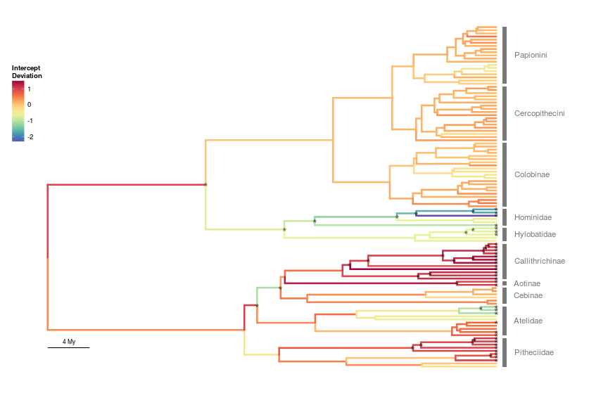

***

--- &vertical

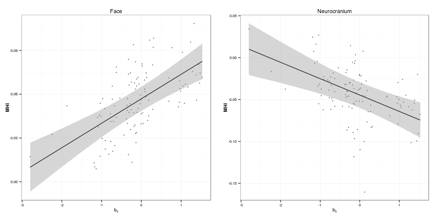

***

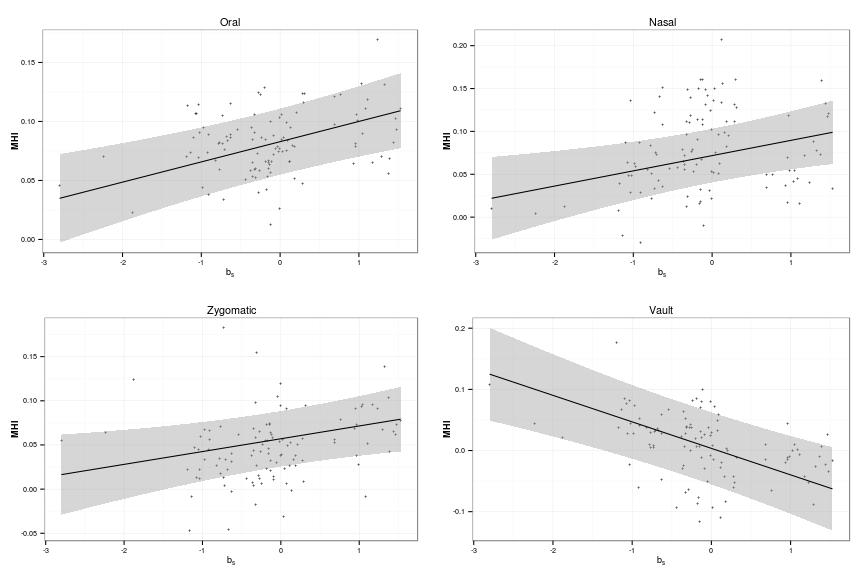

--- &vertical

## Respostas

*Os parâmetros de alometria estática no crânio mudaram ao longo da diversificação dos Anthropoidea?*

&nbsp;
- Sim! Interceptos mudaram mais que inclinações.

- Mudanças detectáveis nas inclinações em *Homo* e *Gorilla*.

***

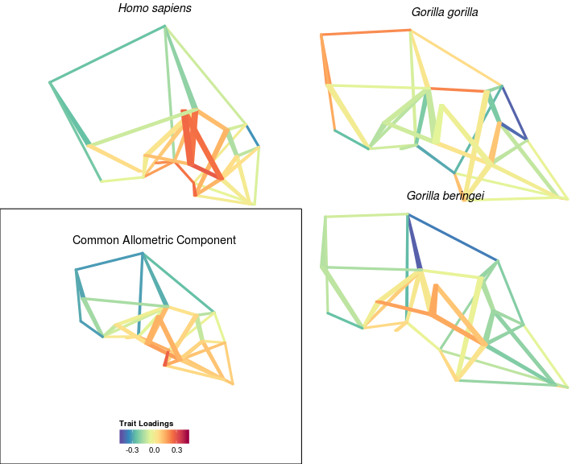

---

*Existe relação entre estes parâmetros (em especial, $b_s$) e a magnitude de associação entre caracteres nas diferentes regiões do crânio?*

&nbsp;
> - Sim, com relações opostas para caracteres da Face (+) e do Neurocrânio (-).
