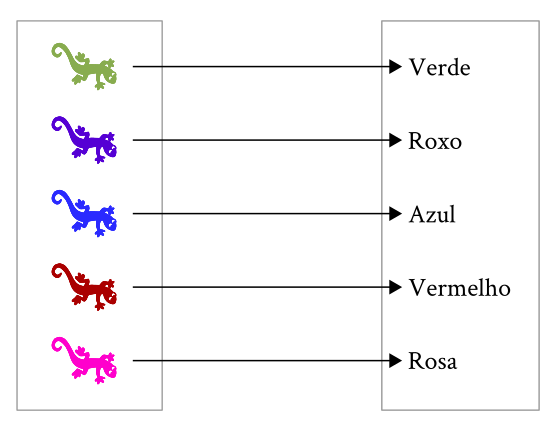
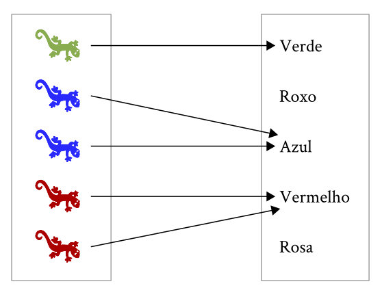

---
title: "Homologias, Caracteres e Mensurações"
subtitle: "Modularidade: conectando padrões e processos em evolução multivariada"
author: Guilherme Garcia
logo: ../../logo.png
output:
  ioslides_presentation:
    transitions: faster
    self_contained: true
    widescreen: false
    fig_caption: true
    toc: true
    css: extra.css
csl: /home/guilherme/Dropbox/Tese/Bib/evolution.csl
bibliography: /home/guilherme/Dropbox/Global/tudo.bib
---	

# Objetivos {.objs}

> - Prover definições precisas destes três conceitos

> - Identificar a estrutura imposta por estes conceitos em análises comparativas entre organismos

> - Revelar pressupostos escondidos no processo de definir e mensurar caracteres

## Caracteres {.centered}

## Caracteres {.centered}

## Mapa Genótipo-Fenótipo {.centered}

