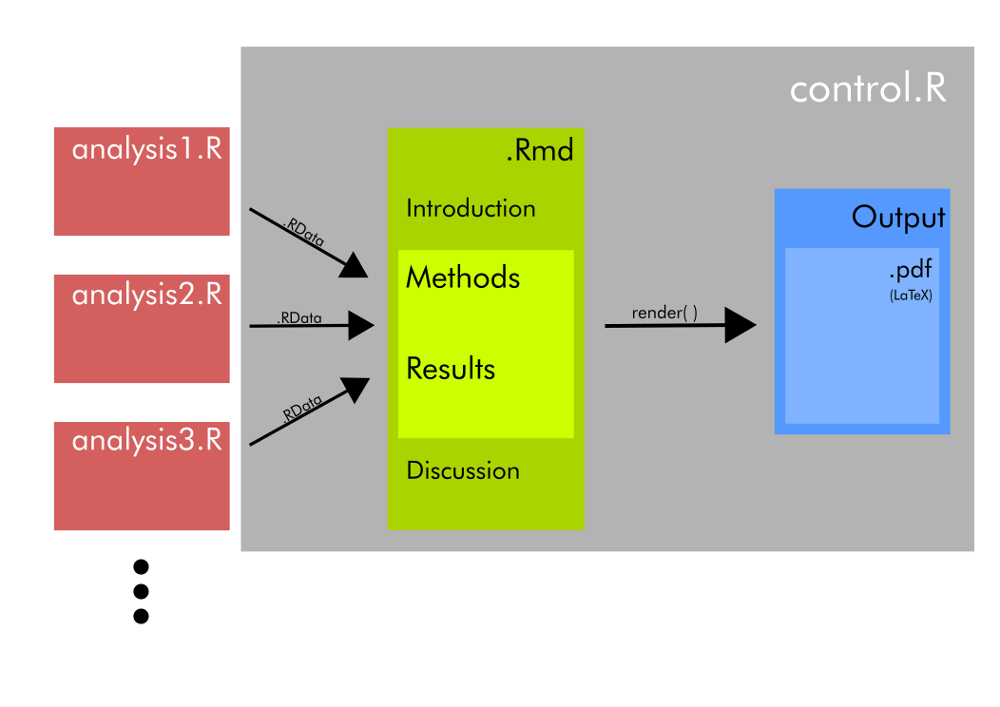
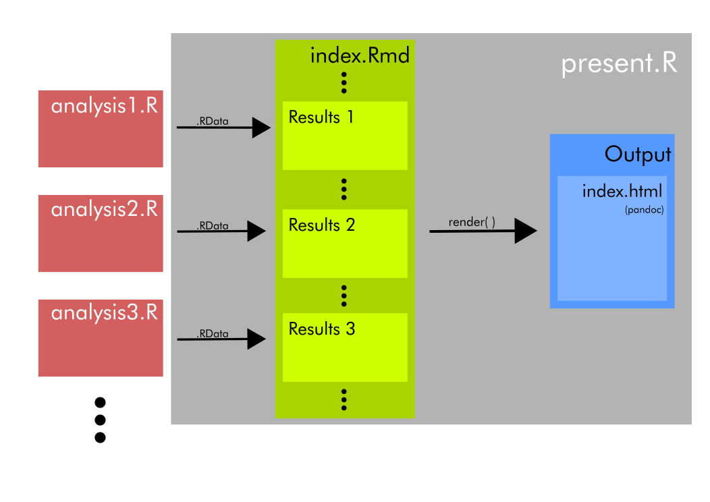
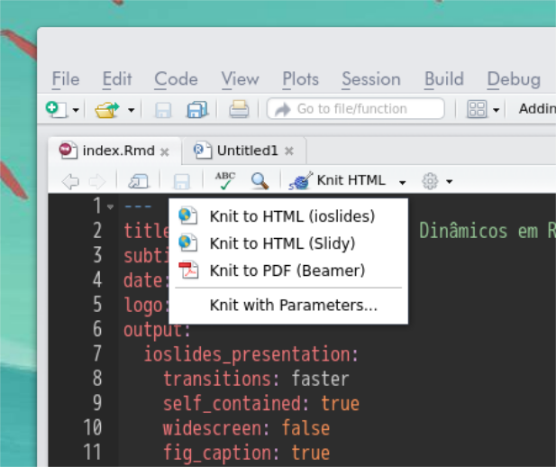
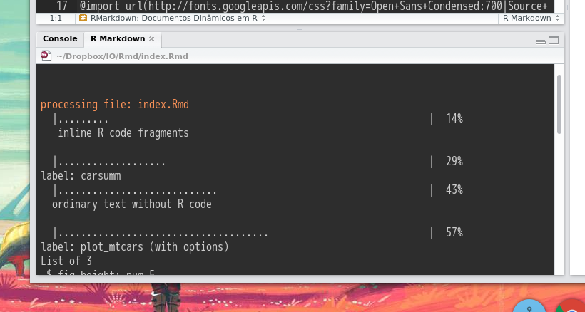
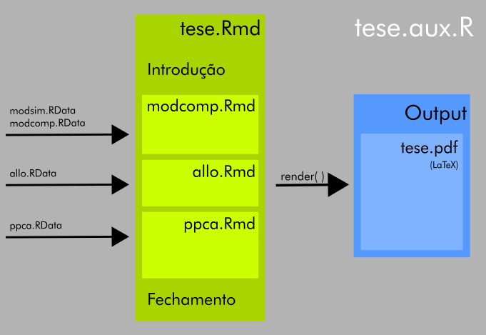
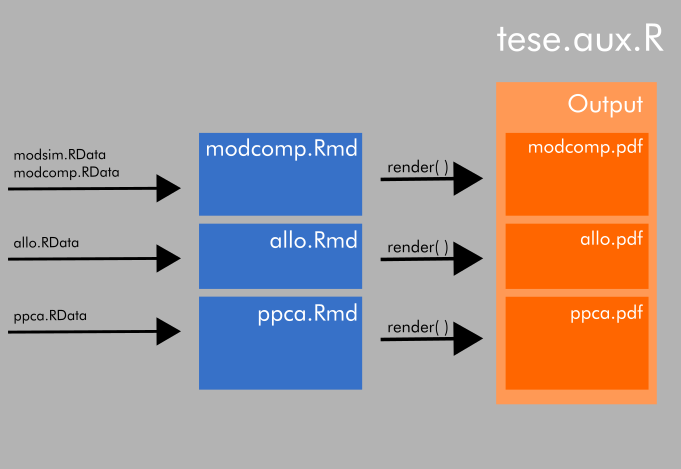

---
title: "RMarkdown: Documentos Dinâmicos em R"
subtitle: "Guilherme Garcia"
date: 06 de Julho de 2016
logo: ../Figuras/Rlogo.png
output:
  ioslides_presentation:
    transitions: faster
    self_contained: true
    widescreen: false
    fig_caption: true
    toc: true
    css: extra.css
---	

<style>
@import url(http://fonts.googleapis.com/css?family=Open+Sans+Condensed:700|Source+Code+Pro:500|Open+Sans|Oswald);
</style>

<style type='text/css'>
img {
    max-height: 560px;
    max-width: 964px;
}
</style>

<script type="text/x-mathjax-config">
  MathJax.Hub.Config({ TeX: { extensions: ["color.js"] }});
</script>

## Markdown

* Linguagem estilo _markup_ para formatação de documentos

* Ferramenta para conversão em HTML

* Sintaxe minimalista

* Diferentes versões, diferentes propósitos

##

<pre><code>## Markdown

* Linguagem estilo _markup_ para formatação de documentos

* Ferramenta para conversão em HTML

* Sintaxe minimalista

* Diferentes versões, diferentes propósitos</code></pre>

## RMarkdown {.smaller}

<div class='centered'>

</div>

&nbsp;

* **knitr**: converte pedaços de código em R para LaTeX/Markdown

* **pandoc**: conversor de formatos de texto multiuso

* formatos possíveis de saída:
    + texto: pdf (LaTeX), docx, rtf, odt;
    + apresentação: pdf (LaTeX + Beamer), ioslides, reveal.js (html);
	+ aplicativos online: shiny
    + etc...

# Estrutura do Documento

* Preâmbulo

* Código

* Figuras e Tabelas

* Referências

## Preâmbulo

<pre><code>---
title: "A Phylogenetic Analysis of Covariance Structure in Anthropoids"
author: G. Garcia^1,2^, F. B. de Oliveira^1^ & G. Marroig^1^
date: "`r format(Sys.time(), '%d %B %Y')`"
output:
  pdf_document:
    includes:
      in_header: Tex/ppca_head.tex
      before_body: Tex/chap_info.tex
    fig_caption: true
    keep_tex: true
fontsize: 12pt
csl: Bib/journal-of-evolutionary-biology.csl
bibliography: Bib/ppca.bib
---</code></pre>

## Código em Pedaços

<pre>
<code>```{r carsumm}
data(cars)
summary(cars)
``` </code>
</pre>

<pre>
<code>```{r plot_mtcars, fig.height = 5, fig.width = 8, echo = FALSE}
require(ggplot2)
ggplot(mtcars, aes(wt, mpg)) + geom_point() + theme_bw()
``` </code>
</pre>

## Código em Pedaços

```{r carsumm}
data(cars)
summary(cars)
```
## Código em Pedaços

```{r plot_mtcars, fig.height = 5, fig.width = 8, echo = FALSE}
require(ggplot2)
ggplot(mtcars, aes(wt, mpg)) + geom_point() + theme_bw()
```

## Tabelas 

* Markdown possui um formato próprio de tabelas

<pre>
|   |    speed    |     dist      |
|:--|:------------|:--------------|
|   |Min.   : 4.0 |Min.   :  2.00 |
|   |1st Qu.:12.0 |1st Qu.: 26.00 |
|   |Median :15.0 |Median : 36.00 |
|   |Mean   :15.4 |Mean   : 42.98 |
|   |3rd Qu.:19.0 |3rd Qu.: 56.00 |
|   |Max.   :25.0 |Max.   :120.00 |
</pre>

* kable() disponível no pacote knitr produz uma saída compatível com o formato

##

```{r kable}
require(knitr)
kable(summary(cars))
```

## Figuras

* cabeçalho do pedaço de código define parâmetros da figura:

<pre>
<code>```{r plot_something, fig.height = 5, fig.width = 8, fig.cap = "Something"}</code>
</pre>

* opção por formatos de saída distintos (default: pdf)
    + dispositivos gráficos disponíveis em R

* não existe implementação de referência às figuras no texto

* para figuras que não vem do R:

<pre><code></code></pre>

## Equações

* Sintaxe do LaTeX:

<pre>
<code>$$
\frac{dx_i}{dt} = f(x_i) + \sum_{j=1}^n\mathbf{A}_{ij} \cdot g(x_i, x_j)
$$</code>
</pre>

$$
\frac{dx_i}{dt} = f(x_i) + \sum_{j=1}^n\mathbf{A}_{ij} \cdot g(x_i, x_j)
$$

* permite equações _inline_

## Referências

Supondo a existência de um banco de dados declarado no preâmbulo do documento

<pre>
<code>[@lande_quantitative_1979; @arnold_constrains_1992]</code>
</pre>

* Impressão da referências ao longo do texto baseada em templates em css

* Ao final do documento, a lista de referências é impressa automaticamente

# Fluxo de Trabalho

## {.centered}



## {.centered}



## RStudio {.centered}



## RStudio {.centered}



# Exemplo: phd.Rmd

## {.centered}



## {.centered}



## Porque usar RMarkdown?

* Curva de aprendizado rápida

* Flexibilidade e Eficiência

* Nenhum conhecimento sobre outras linguagens será desperdiçado!

* Ciência aberta

## Links

[phd.Rmd no GitHub](https://github.com/wgar84/phd.Rmd)

[esta apresentação](http://wgar84.github.io/Rmd)

[código de apresentações no GitHub](https://github.com/wgar84/wgar84.github.io)

[RMarkdown cheatsheet](https://www.rstudio.com/wp-content/uploads/2015/02/rmarkdown-cheatsheet.pdf)

